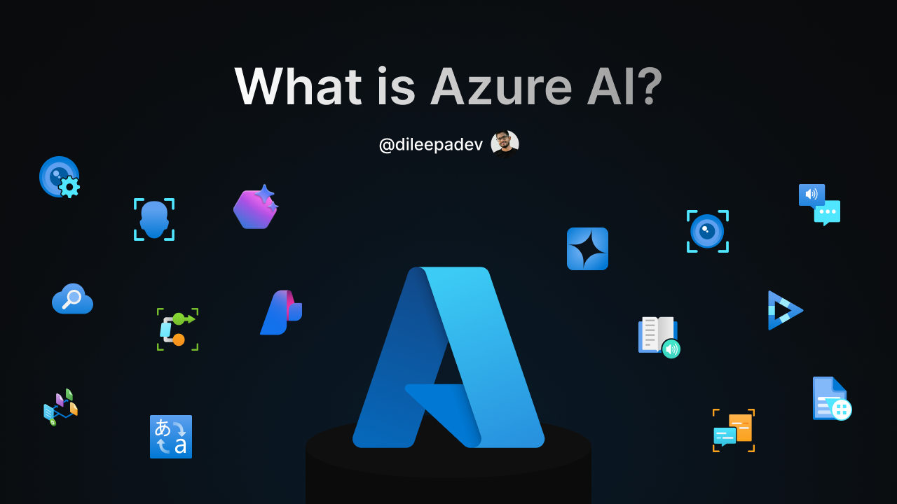

# v2d250306 - What is Azure AI

## Link

[https://youtu.be/YfrZkAx2Eao](https://youtu.be/YfrZkAx2Eao)

## ID

v2d250306

## Published on

6 Mar 2025

## Title

What is Azure AI

## Description

🎥 About the Video:
In this video, we explore Azure AI, Microsoft's powerful suite of artificial intelligence tools and services. Whether you're a developer or business leader, Azure AI helps you build smarter applications and enhance business operations without needing deep expertise in AI or machine learning.

💡 We’ll cover:

- What Azure AI is and how it enables intelligent application development
- An introduction to Azure AI Services and Azure AI Foundry, two key platforms to get you started
- Helpful links to official documentation and resources

🔗 Resources:

- Azure AI Official Page: <https://azure.microsoft.com/en-us/solutions/ai?wt.mc_id=studentamb_197162>
- Azure AI Services Documentation: <https://learn.microsoft.com/en-us/azure/ai-services?wt.mc_id=studentamb_197162>
- Azure AI Foundry: <https://ai.azure.com>

⏰ Timestamps:  
00:00 - Introduction  
00:28 - What is Azure AI?  
06:10 - What are Azure AI Services?  
08:07 - Azure OpenAI  
09:03 - Azure AI Agent  
09:45 - Azure AI Search  
10:18 - Azure AI Speech  
10:47 - Azure AI Document Intelligence  
11:27 - Azure AI Video Indexer  
11:55 - Azure AI Vision  
12:27 - Azure AI Custom Vision  
13:07 - Azure AI Face  
13:49 - Azure AI Translator  
14:30 - Azure AI Language  
14:57 - Azure AI Immersive Reader  
15:33 - Azure AI Content Safety  
16:16 - Azure AI Content Understanding  
17:02 - Azure AI Foundry  
18:16 - Conclusion  

Let me know in the comments what AI projects you're excited to build with Azure!

Thanks for watching, and I’ll see you in the next video! 💖  
Until then, keep your intelligence sharp! 🧠

## Resources

- Presentation/Slides: [v2d250306 - What is Azure AI.pdf](./v2d250306%20-%20What%20is%20Azure%20AI.pdf)
