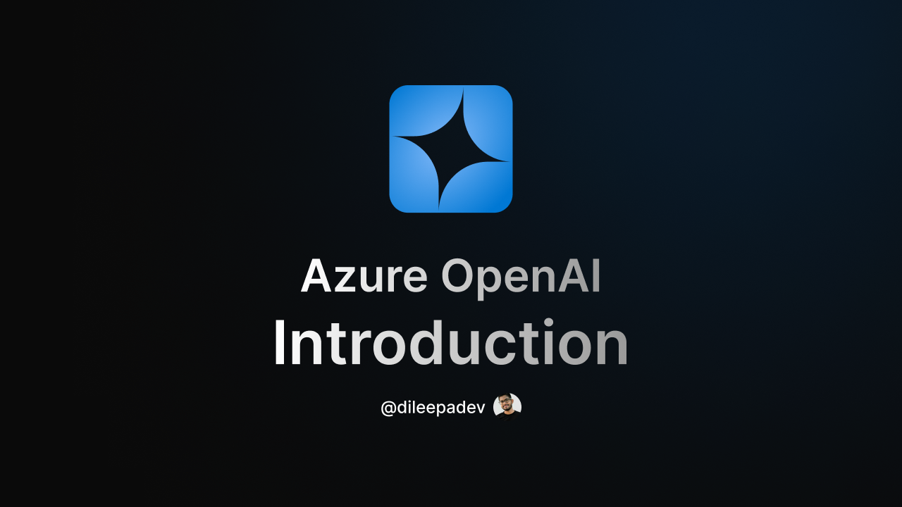

# v3d250306 - Introduction to Azure OpenAI

## Link

[https://youtu.be/r8BBhdqZfzo](https://youtu.be/r8BBhdqZfzo)

## ID

v3d250306

## Published on

6 Mar 2025

## Title

Introduction to Azure OpenAI

## Description

🎥 About the Video:
In this video, we'll explore Azure OpenAI and get an introduction to how we can leverage OpenAI’s powerful models through Microsoft’s Azure platform. With Azure OpenAI, you can integrate state-of-the-art AI capabilities like language models, GPT, and more into your applications, all within a secure and scalable environment.

💡 We’ll cover:

- What Azure OpenAI is and how it works
- Key features of the platform, including access to OpenAI’s advanced models
- How Azure OpenAI can help enhance your applications with AI-driven capabilities

🔗 Resources:

- Azure OpenAI Official Page: <https://azure.microsoft.com/en-us/services/cognitive-services/openai?wt.mc_id=studentamb_197162>
- Azure OpenAI Documentation: <https://learn.microsoft.com/en-us/azure/ai-services/openai?wt.mc_id=studentamb_197162>
- OpenAI Documentation: <https://platform.openai.com/docs>

⏰ Timestamps:  
00:00 - Introduction  
00:17 - What is Azure OpenAI Services?  
01:25 - Key Features & Concepts  
02:16 - Available Models  
04:26 - Important Fact  
05:06 - Custom Model Training with Fine-tuning  
06:54 - Capabilities and APIs  
07:19 - Text Generation  
08:14 - Vision  
09:07 - Image Generation  
09:52 - Text to Speech  
10:41 - Embeddings  
11:29 - Reasoning  
12:07 - Function Calling  
12:50 - Vector Stores  
13:50 - Chat  
14:32 - Assistants  
15:16 - Supported Programming Languages & SDKs  
17:06 - Other Languages and Tools (for broader access)  
18:08 - Quotas and Limits  
19:13 - Cost Management and Pricing  
21:21 - ... and there are many more  
21:38 - Security and Compliance  
21:51 - Data Privacy  
21:57 - Responsible AI  
22:08 - Integration with Azure Ecosystem  
22:30 - Scalability  
22:48 - Model Monitoring and Analytics  
23:11 - Model Deployment Options  
23:29 - Community and Support  
23:48 - More?  
23:58 - Setting Up Azure OpenAI Resource in the Azure Portal  
26:23 - Conclusion  

If you're excited to explore the possibilities of integrating OpenAI's models into your projects, let me know in the comments!

Thanks for watching, and I’ll see you in the next video! 💖  
Until then, keep your intelligence sharp! 🧠

## Resources

- Presentation/Slides: [v3d250306 - Introduction to Azure OpenAI.pdf](./v3d250306%20-%20Introduction%20to%20Azure%20OpenAI.pdf)
