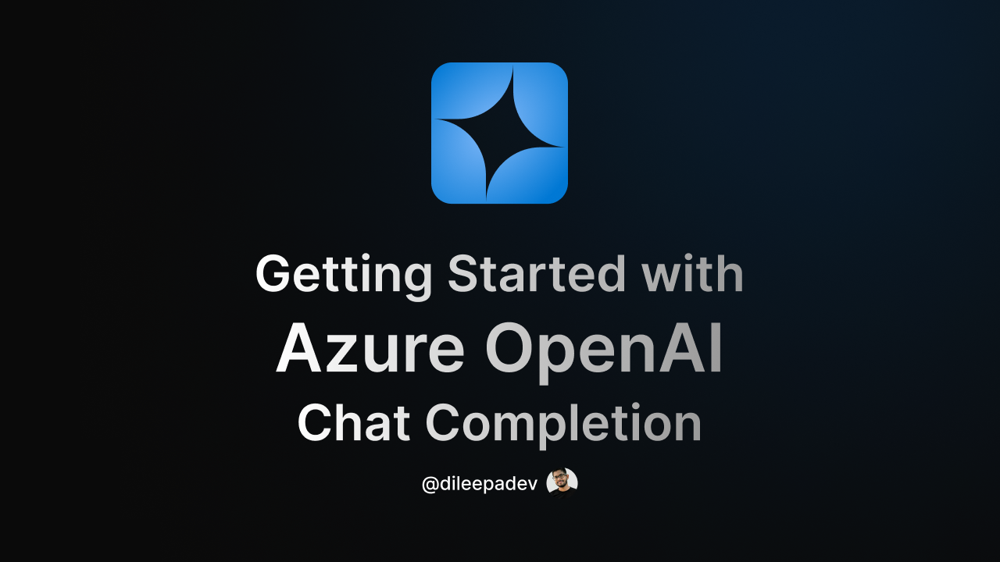
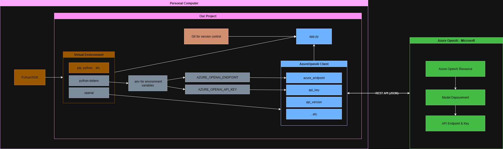

# v4d250308 - Getting Started with Azure OpenAI and Chat Completion

## Link

[https://youtu.be/Woi9-KWkK_k](https://youtu.be/Woi9-KWkK_k)

## ID

v4d250308

## Published on

8 Mar 2025

## Title

Getting Started with Azure OpenAI and Chat Completion

## Description

🎥 About the Video:
In this video, we’re getting started with Azure OpenAI and Chat Completion.

💡 We’ll cover:

- How Azure OpenAI Chat Completion works
- Setting up a resource group and Azure OpenAI resource
- Building a Python CLI demo step by step

🔗 Resources:

- Introduction to Azure OpenAI: <https://youtu.be/r8BBhdqZfzo?si=brOKppYaDUx6Eslu>
- Azure OpenAI Official Page: <https://azure.microsoft.com/en-us/services/cognitive-services/openai?wt.mc_id=studentamb_197162>
- Azure OpenAI Documentation: <https://learn.microsoft.com/en-us/azure/ai-services/openai?wt.mc_id=studentamb_197162>
- OpenAI Documentation: <https://platform.openai.com/docs>
- Quickstart: Get started using GPT-35-Turbo and GPT-4 with Azure OpenAI Service: <https://learn.microsoft.com/en-us/azure/ai-services/openai/chatgpt-quickstart?wt.mc_id=studentamb_197162>
- Azure OpenAI Service models: <https://learn.microsoft.com/en-us/azure/ai-services/openai/concepts/models?wt.mc_id=studentamb_197162>
- Abbreviation recommendations for Azure resources: <https://learn.microsoft.com/en-us/azure/cloud-adoption-framework/ready/azure-best-practices/resource-abbreviations?wt.mc_id=studentamb_197162>
- Azure OpenAI deployment types: <https://learn.microsoft.com/en-us/azure/ai-services/openai/how-to/deployment-types?wt.mc_id=studentamb_197162>
- Project Diagram: <https://github.com/dileepadev/youtube/tree/main/v4d250308%20-%20Getting%20Started%20with%20Azure%20OpenAI%20and%20Chat%20Completion/v4d250308_diagram.png>
- Project Source Code: <https://github.com/dileepadev/youtube/tree/main/v4d250308%20-%20Getting%20Started%20with%20Azure%20OpenAI%20and%20Chat%20Completion/movie_recommender>

⏰ Timestamps:  
00:00 - Introduction  
00:43 - What is Azure OpenAI Chat Completion?  
01:37 - Why is this Important?  
02:24 - Available Models  
03:04 - Alright, it's time for the demo!  
03:48 - Create Azure resource group  
08:11 - Create Azure OpenAI resource  
14:57 - Open Azure AI Foundry portal  
15:37 - Azure AI Foundry | Azure OpenAI Service  
20:21 - Start working with Chat Playground  
20:55 - Deploy a model  
24:02 - Continue working with Chat Playground  
28:50 - Quick start documentation  
29:52 - Project diagram explain  
37:03 - Project code explain  

By the end, you’ll have a working setup and a better understanding of how to integrate Azure OpenAI into your projects! 🚀

If you're excited to explore the possibilities of integrating OpenAI's models into your projects, let me know in the comments!

Thanks for watching, and I’ll see you in the next video! 💖  
Until then, keep your intelligence sharp! 🧠

## Resources

- Presentation/Slides: [v4d250308 - Getting Started with Azure OpenAI and Chat Completion.pdf](./v4d250308%20-%20Getting%20Started%20with%20Azure%20OpenAI%20and%20Chat%20Completion.pdf)
- Project Source Code: [movie_recommender](./movie_recommender/)
- Diagram: [v4d250308_diagram.png](./v4d250308_diagram.png)  

    
