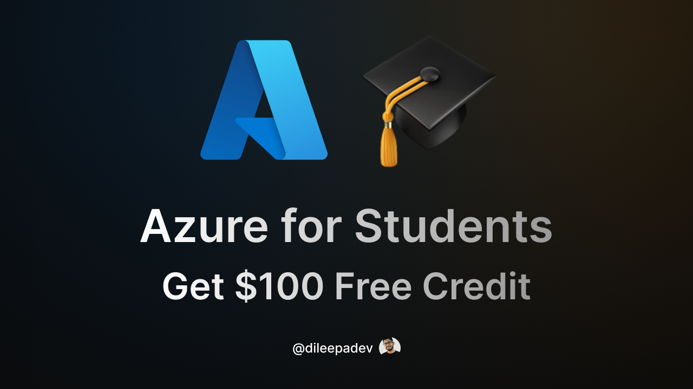

# v5d251006 - Create Azure for Students Account with a Voucher – Get $100 Free Credit

## Link

[https://youtu.be/bhMGtA7Q4XY](https://youtu.be/bhMGtA7Q4XY)

## ID

v5d251006

## Published on

6 Oct 2025

## Title

Create Azure for Students Account with a Voucher – Get $100 Free Credit

## Description

🎓 How to Activate Your Azure for Students Voucher (Step-by-Step Guide)

Looking to claim free $100 in Azure credits as a student? This video walks through the exact process to activate the Azure for Students voucher, even without a university email address.

✅ What’s included:

* How to create a new Microsoft account (if needed)
* How to sign up for Azure for Students
* Academic verification steps
* Accessing and checking the free Azure credits

🔗 Azure for Students Link: <https://azure.microsoft.com/free/students?wt.mc_id=studentamb_197162>

No credit card required. Just follow along and get started with Azure cloud services today!

## Resources

* Presentation/Slides: [v5d251006 - Create Azure for Students Account with a Voucher – Get $100 Free Credit.pdf](./v5d251006%20-%20Create%20Azure%20for%20Students%20Account%20with%20a%20Voucher%20–%20Get%20$100%20Free%20Credit.pdf)
