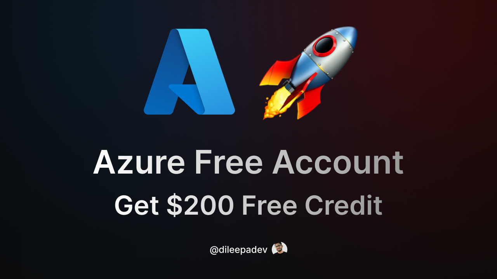

# v6d251007 - Create Azure Free Account – Get $200 Free Credit

## Link

[https://youtu.be/u7GFfv8KEaA](https://youtu.be/u7GFfv8KEaA)

## ID

v6d251007

## Published on

7 Oct 2025

## Title

Create Azure Free Account – Get $200 Free Credit

## Description

🚀 How to Create a Free Azure Account – Get $200 Credit (Step-by-Step Guide)

Looking to get started with Microsoft Azure without spending anything upfront? This video walks through the exact steps to create a free Azure account and receive $200 in free credits to explore over 55+ Azure services.

✅ What’s included:

* How to create a Microsoft account (if needed)
* Step-by-step Azure Free Account sign-up process
* Identity verification with a credit card (no charges)
* How to check and manage the $200 credit

🔗 Azure Free Account Sign-Up Link: <https://azure.microsoft.com/free>

⚠️ A valid credit card is required for identity verification, but no charges will be made unless the subscription is upgraded.

⚠️ A small temporary authorization hold (not a charge) may be placed on your credit card for verification, typically removed within 3-5 days. This verifies the card's validity and is not an actual charge. If you encounter issues or believe the hold is a real charge, verify your billing address, try a different browser, ensure your account details are correct, and contact Azure Support for assistance.

Perfect for developers, students, and beginners looking to test and learn cloud services with no upfront cost.

## Resources

* Presentation/Slides: [v6d251007 - Create Azure Free Account – Get $200 Free Credit.pdf](./v6d251007%20-%20Create%20Azure%20Free%20Account%20–%20Get%20$200%20Free%20Credit.pdf)
